# ARCHITECTURE.md

# USDC Control Plane  
**Trust Invariants for Programmable Assets**

Static single-page application: built assets served as files (e.g. Coolify static hosting).

No backend.  
No database.  
No live chain integrations.  
Simulation only.

---

# 1. System Context

## Purpose

The application is a simulated internal control plane demonstrating:
- tokenization infrastructure thinking
- trust invariants
- failure domains
- state transitions
- programmable asset flows

---

## System Context Diagram

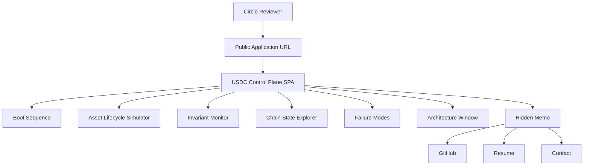

---

# 2. Deployment Architecture

## Hosting Architecture

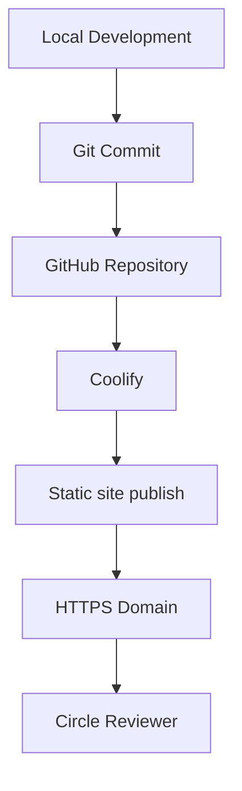

---

## Deployment Runtime

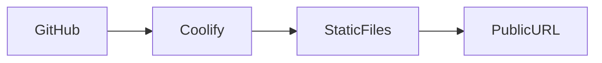

---

# 3. Repository Architecture

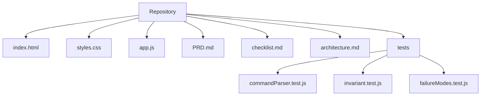

---

# 4. Runtime Architecture

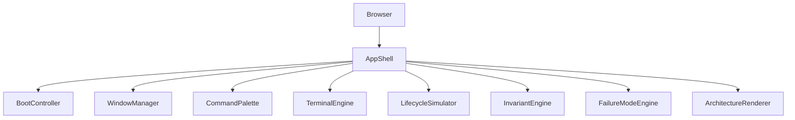

---

# 5. UI State Model

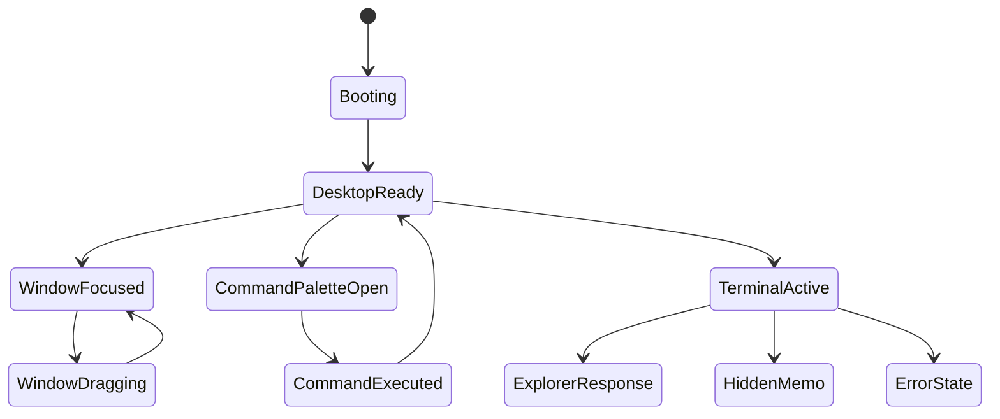

---

# 6. Desktop Layout Architecture

Default layout:

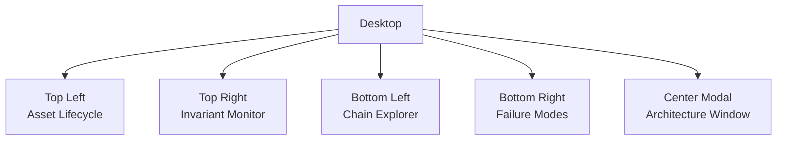

---

# 7. Boot Sequence Flow

```mermaid
sequenceDiagram

participant User
participant Browser
participant Boot
participant Desktop

User->>Browser: open URL

Browser->>Boot:
initialize boot sequence

Boot->>Boot:
load system logs

Boot->>Boot:
verify invariants

Boot->>Boot:
scan failure domains

Boot->>Desktop:
show desktop shell

Desktop->>User:
interactive control plane ready
```

---

# 8. Hybrid Asset Lifecycle Architecture

## High-Level Flow

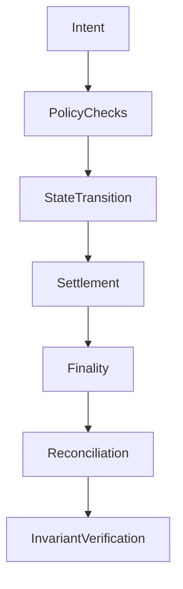

---

## Hybrid Modes

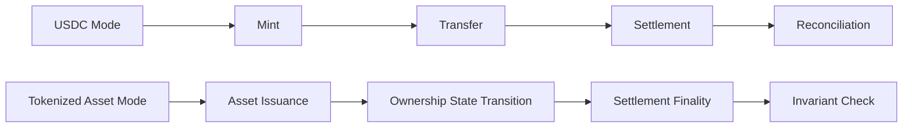

---

# 9. Lifecycle Simulation Sequence

```mermaid
sequenceDiagram

participant User
participant Simulator
participant Invariants
participant UI

User->>Simulator:
Run Simulation

Simulator->>Simulator:
Mint

Simulator->>Simulator:
Transfer

Simulator->>Simulator:
Settlement

Simulator->>Simulator:
Finality

Simulator->>Simulator:
Reconciliation

Simulator->>Invariants:
Verify invariants

Invariants->>UI:
PASS status
```

---

# 10. Trust Invariant Architecture

## Core Invariants

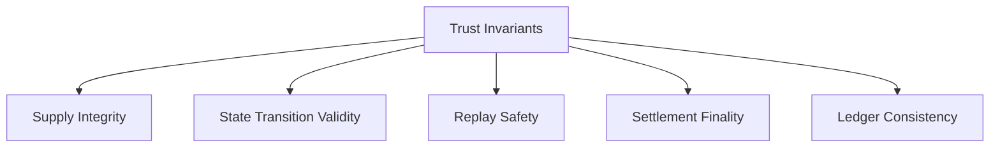

---

## Invariant Update Logic

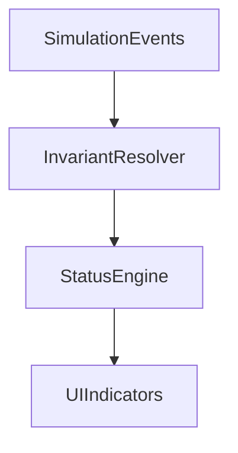

---

# 11. Chain State Explorer Architecture

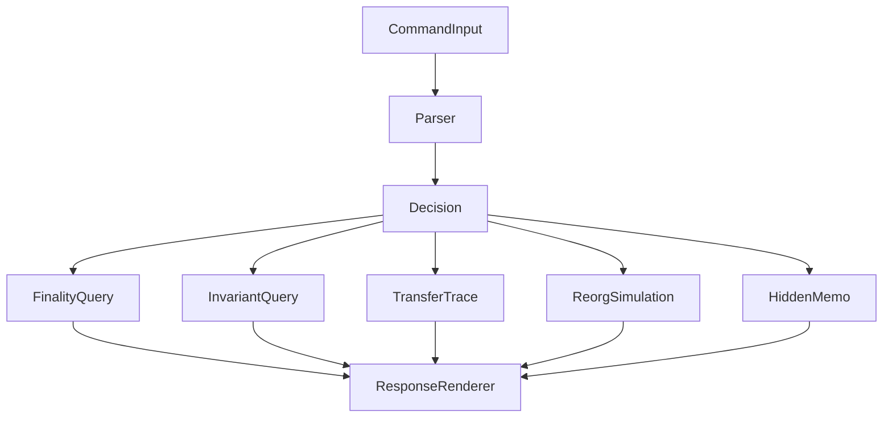

---

## Command Parser Flow

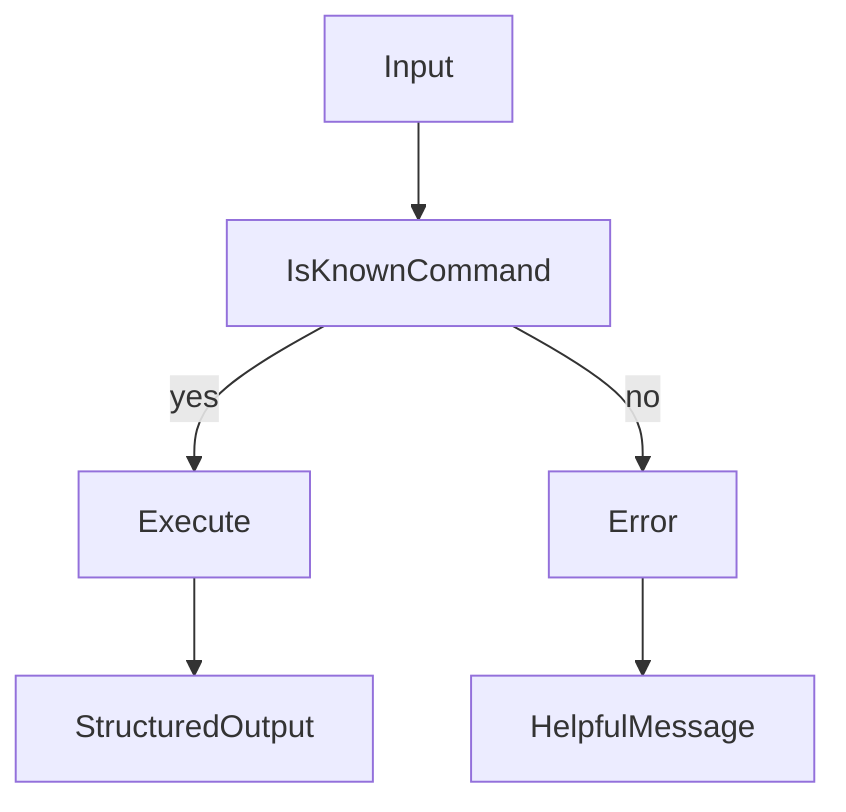

---

# 12. Failure Modes Architecture

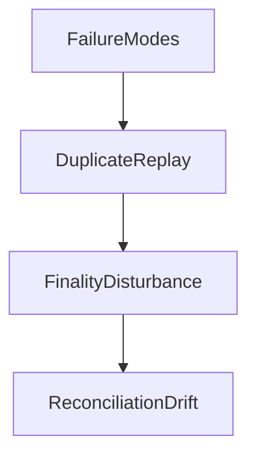

---

## Duplicate Replay Flow

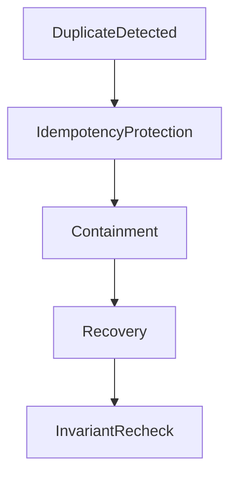

---

## Finality Disturbance Flow

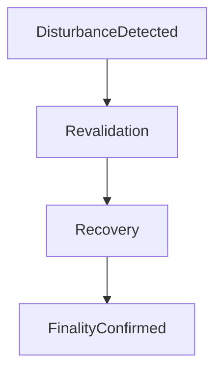

---

## Reconciliation Drift Flow

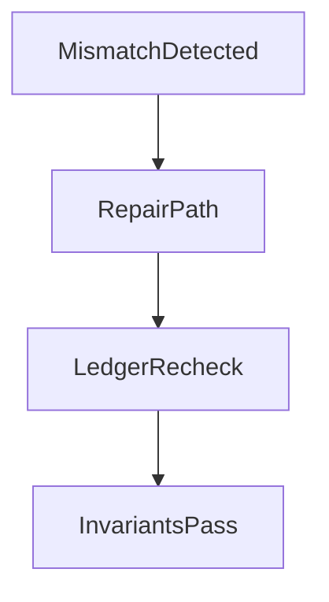

---

# 13. Failure Mode Sequence

```mermaid
sequenceDiagram

participant User
participant FailureEngine
participant Recovery
participant Invariants

User->>FailureEngine:
Run scenario

FailureEngine->>FailureEngine:
Inject failure

FailureEngine->>Recovery:
Trigger recovery logic

Recovery->>Invariants:
Recheck system invariants

Invariants->>User:
Safe state verified
```

---

# 14. Window Manager Architecture

```mermaid
flowchart TD

MouseDown
--> DragStart

DragStart
--> MouseMove

MouseMove
--> PositionUpdate

PositionUpdate
--> MouseUp

MouseUp
--> DragEnd
```

---

## Window Focus Logic

```mermaid
flowchart TD

WindowClick
--> RaiseZIndex
--> FocusedWindow
```

---

# 15. Command Palette Architecture

```mermaid
flowchart TD

KeyboardListener
--> CmdK

CmdK
--> PaletteOpen

PaletteOpen
--> SearchCommands

SearchCommands
--> CommandSelected

CommandSelected
--> WindowLaunch

CommandSelected
--> ActionExecution
```

---

# 16. Testing Architecture

## Verification Flow

```mermaid
flowchart TD

Build
--> AutomatedChecks

AutomatedChecks
--> ManualLocal

ManualLocal
--> LiveCoolifyVerify

LiveCoolifyVerify
--> UserAcceptance

UserAcceptance -->|pass| NextPhase
UserAcceptance -->|fail| FixAndRetest
```

---

## Unit Test Coverage

```mermaid
flowchart TD

Tests
--> CommandParserTests
--> InvariantTests
--> FailureModeTests
```

---

# 17. Coolify Deployment Architecture

```mermaid
flowchart TD

PushToGitHub
--> CoolifyWebhook

CoolifyWebhook
--> StaticPublish

StaticPublish
--> LiveProductionURL
```

---

## Rollback Flow

```mermaid
flowchart TD

BadDeploy
--> DetectIssue
--> Rollback
--> PreviousStableRelease
```

---

# 18. Security Boundary

```mermaid
flowchart TD

Browser
--> SimulatedDataOnly

SimulatedDataOnly -. no live chain .-> BlockchainRPC

SimulatedDataOnly -. no secrets .-> Secrets

SimulatedDataOnly -. no database .-> Persistence
```

Security assumptions:
- no private keys
- no wallet interaction
- no live chain calls
- no user data collection

---

# 19. Conceptual layering (simulation-only)

Conceptual separation of policy vs settlement paths—inspiration only:

```mermaid
flowchart TD

OwnershipStateTransitions
--> StateMachineThinking

StateMachineThinking
--> AssetLifecycleModeling

AssetLifecycleModeling
--> TrustInvariantDesign
```

Reference is conceptual, not product dependency.

---

# 20. Non-Goals Architecture

Excluded intentionally:

```mermaid
flowchart TD

Excluded
--> NoBackend
--> NoDatabase
--> NoAuth
--> NoLiveBlockchain
--> NoAnalytics
--> NoFrameworkComplexity
```

Scope protection.

---

# 21. Future Stretch Architecture (Optional)

Only after MVP complete.

```mermaid
flowchart TD

MVP
--> ConsensusDisturbanceSimulator
--> RichTelemetryLayer
--> DeepLinkableScenarios
--> ReactUpgradeOptional
```

Not in current scope.