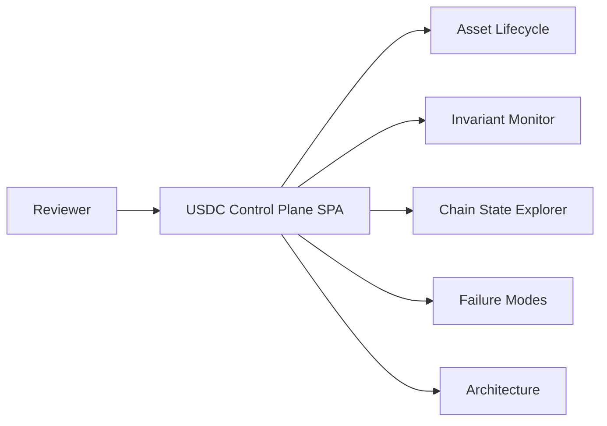
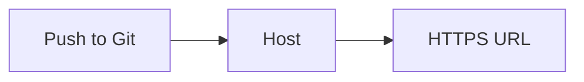
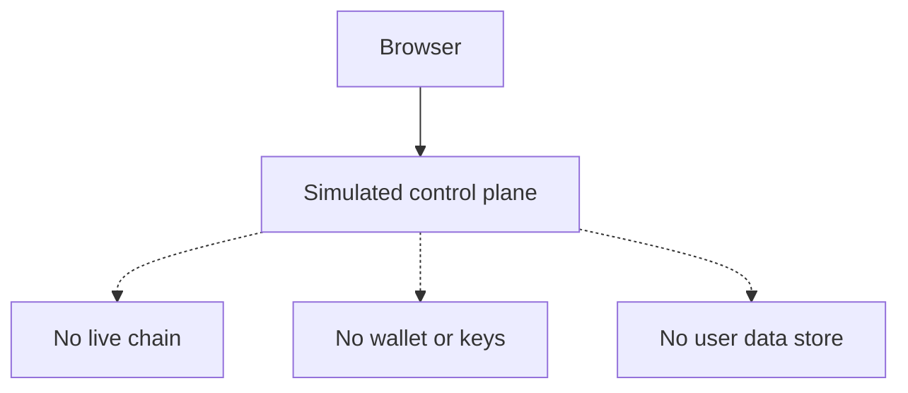
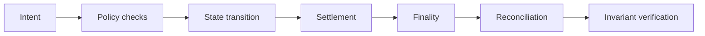

# Architecture

**USDC Control Plane** — trust invariants for programmable assets (simulation only).

## Stack

- **Client:** static HTML, CSS, and JavaScript (no framework required for v1).
- **Hosting:** files published to HTTPS (e.g. Coolify static site).
- **Not included:** backend, database, auth, live blockchain RPC, analytics.

---

## System at a glance

What the reviewer loads in the browser and which windows map to which concerns.

The **command palette** (e.g. Ctrl/⌘+K) and **hidden memo** paths reuse the same shell; they are not separate servers.

---

## Deploy path

The host syncs or copies the repo root; the browser only fetches static assets.

---

## Trust boundary

All state is **simulated in the browser**. Nothing in this artifact calls a production chain or holds keys.

---

## Simulation pipeline (conceptual)

High-level stages the **Lifecycle** window walks through (USDC and tokenized modes differ in labels; same idea).

---

## Testing (repo)

Automated checks run with Node’s test runner: command parser, invariant resolver, failure scenarios, and palette filtering. See `package.json` and `tests/`.

---

## Diagrams in this file

Markdown code fences with the **`mermaid`** language tag render on **GitHub** in ordinary `.md` previews (you do **not** need MDX). After editing a diagram, run `pnpm run check` — it runs `scripts/validate-mermaid-architecture.mjs`, which parses each block with the **`mermaid`** package (plus a **happy-dom** shim so Node provides the DOM APIs that Mermaid expects).
